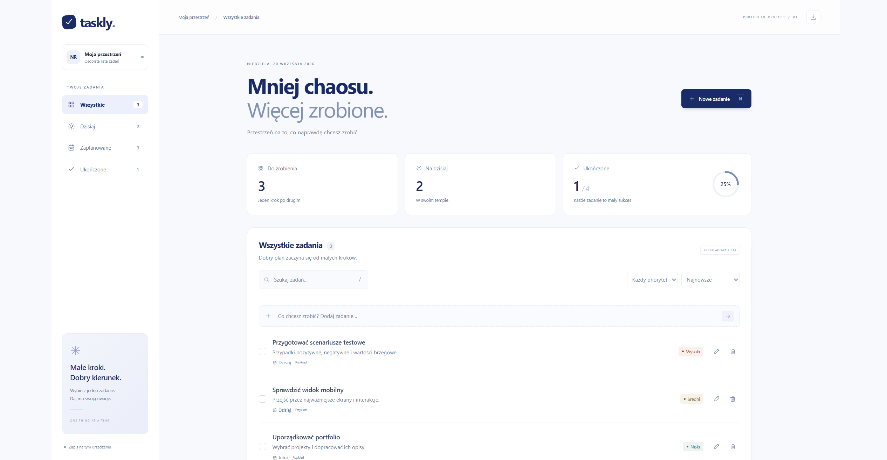

# 🎯 Taskly - Nowoczesna aplikacja To-Do & QA Portfolio



> **O projekcie:** Taskly to intuicyjna aplikacja webowa do zarządzania zadaniami, zaprojektowana z naciskiem na przejrzysty interfejs (UI) oraz niezawodną logikę biznesową. Repozytorium to stanowi kluczowy element mojego portfolio QA, demonstrując zarówno strukturę nowoczesnego kodu frontendowego, jak i profesjonalne podejście do zapewnienia jakości (Shift-Left QA) poprzez testy jednostkowe oraz pełną dokumentację testową.


## ✨ Główne funkcjonalności aplikacji

Aplikacja została zaprojektowana tak, aby maksymalizować produktywność i zapewniać pełną kontrolę nad planem dnia:
* **Zarządzanie zadaniami:** Płynne dodawanie, edycja oraz usuwanie codziennych zadań.
* **Kategoryzacja i widoki:** Organizacja pracy z wykorzystaniem wbudowanych list: Wszystkie, Dzisiaj, Zaplanowane oraz Ukończone.
* **Priorytetyzacja:** Łatwe przypisywanie poziomów ważności do zadań (Wysoki, Średni, Niski).
* **Śledzenie postępów:** Wizualizacja wskaźnika ukończonych zadań w formie wykresu procentowego.
* **Zaawansowane filtrowanie:** Możliwość wyszukiwania konkretnych zadań oraz filtrowania ich po priorytetach i dacie dodania.

## 🧪 Podejście QA i Struktura Testów

Jako Inżynier QA, szczególną uwagę w tym projekcie zwróciłem na niezawodność kodu oraz weryfikację logiki biznesowej:

* **Dokumentacja QA:** Zidentyfikowane przypadki brzegowe, scenariusze testowe (pozytywne i negatywne) oraz raporty z błędów zostały szczegółowo udokumentowane w pliku `QA-REPORT.md`.
* **Testy jednostkowe (Unit Tests):** Operacje na danych i logika zarządzania stanem są rygorystycznie weryfikowane za pomocą testów jednostkowych znajdujących się w dedykowanym pliku `tests/model.test.cjs`.
* **Separacja logiki:** Architektura projektu świadomie dzieli aplikację na warstwę danych/logiki (`model.js`) oraz warstwę prezentacji (`app.js`), co ułatwia izolowane testowanie automatyczne (Testability).

## 📂 Architektura repozytorium

* `index.html` / `styles.css` – Struktura semantyczna oraz stylizacja nowoczesnego interfejsu użytkownika.
* `app.js` – Główny kontroler widoku, logika interakcji z DOM oraz nasłuchiwanie zdarzeń.
* `model.js` – Model danych odpowiadający za operacje CRUD na zadaniach.
* `tests/model.test.cjs` – Zestaw skryptów testowych automatyzujących weryfikację modelu.
* `QA-REPORT.md` – Zestawienie wyników testów manualnych, eksploracyjnych i weryfikacji wymagań.

## 🚀 Uruchomienie środowiska lokalnego

Aby uruchomić aplikację oraz zestaw testów na lokalnym środowisku, postępuj zgodnie z poniższymi krokami:

### 1. Uruchomienie aplikacji UI
Aplikacja wykorzystuje Vanilla JS. Wystarczy sklonować repozytorium i otworzyć plik `index.html` w dowolnej nowoczesnej przeglądarce (zalecane jest użycie rozszerzenia *Live Server* w edytorze kodu dla najlepszego doświadczenia).

### 2. Uruchomienie testów automatycznych
Upewnij się, że posiadasz zainstalowane środowisko Node.js. Otwórz terminal w katalogu głównym projektu i wykonaj polecenia:
```bash
npm install
npm test
