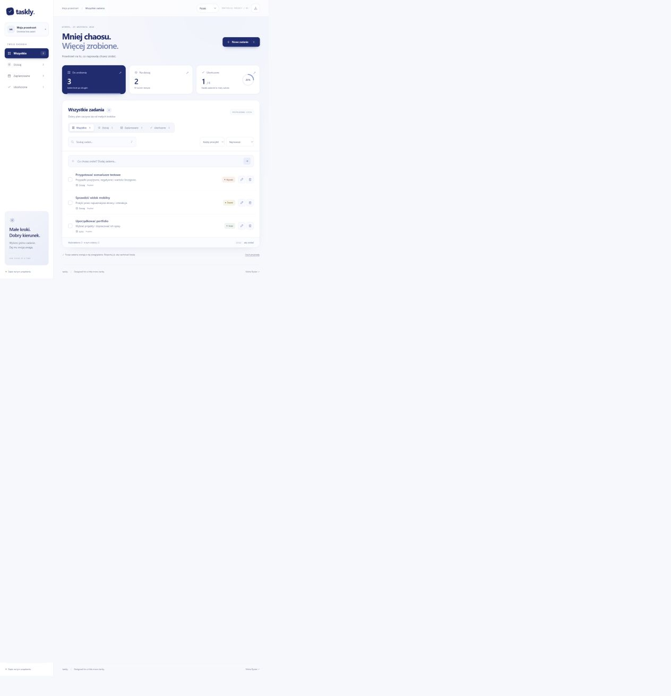

# Taskly — personal task manager

Projekt portfolio Nikity Rysieva. HTML, CSS i JavaScript bez zewnętrznych bibliotek, fontów i usług. Siedem języków, responsywny układ i granatowa stylistyka spójna z portfolio.

## Publikacja na GitHub Pages

1. Wgraj **zawartość** tego folderu do repozytorium. Plik `index.html` powinien znajdować się w jego głównym katalogu, obok CSS i JavaScript.
2. W repozytorium otwórz **Settings → Pages**.
3. Wybierz **Deploy from a branch**, gałąź z plikami (zwykle `main`) i folder **/(root)**. Zapisz ustawienia.
4. Po zakończeniu publikacji GitHub pokaże adres aplikacji. Nie potrzeba instalacji zależności ani budowania projektu.

Paczka zawiera `.nojekyll`. Wszystkie zasoby używają względnych ścieżek, więc aplikacja może działać pod adresem repozytorium. [Instrukcja GitHub Pages](https://docs.github.com/en/pages/getting-started-with-github-pages/configuring-a-publishing-source-for-your-github-pages-site).

## Wersja Premium

- Kafelki podsumowania przełączają widoki: aktywne, dzisiejsze i ukończone zadania.
- Cztery przełączniki nad listą są zsynchronizowane z menu bocznym i licznikami.
- Widok jest zapisany we fragmencie URL; odświeżenie i przyciski Wstecz/Dalej zachowują nawigację.
- Krótkie animacje wejścia, zmiany listy, formularza oraz podświetlenia. Obsługa `prefers-reduced-motion`.
- Zapis `taskly.tasks.v1` jest zgodny z poprzednią wersją. Zadania pozostają dostępne przy aktualizacji pod tym samym adresem; nowa domena ma osobny zapis przeglądarki.

## Uruchomienie

Otwórz `index.html` albo umieść cały folder na hostingu statycznym. Dla stabilnego działania localStorage użyj serwera HTTP, np. `python -m http.server 8080`, i otwórz http://localhost:8080.

## Funkcje

- Dodawanie, edycja, kończenie, przywracanie i usuwanie zadań.
- Cofanie usunięcia przez 15 sekund.
- Notatki, terminy i trzy priorytety.
- Widoki aktywnych, dzisiejszych, zaplanowanych i ukończonych zadań.
- Wyszukiwanie po nazwie i notatce, filtrowanie oraz sortowanie.
- Zapis w localStorage, synchronizacja otwartych kart, eksport JSON.
- Przykładowe zadania oznaczone w UI, możliwe do usunięcia niezależnie od własnych zadań.
- Klawiatura: N — nowe zadanie, / — wyszukiwanie, Escape — zamknięcie formularza.

Widok „Wszystkie” pokazuje zadania aktywne; ukończone mają własną zakładkę. „Zaplanowane” obejmuje wszystkie aktywne zadania z terminem, również zaległe. Termin jest datą lokalną bez godziny.

Dane są lokalne dla przeglądarki i adresu strony. Nie ma konta użytkownika, serwera, synchronizacji między urządzeniami ani powiadomień o terminach. Usunięcie danych przeglądarki usuwa zapis — eksport JSON służy jako kopia. Przy równoczesnych zapisach z wielu kart obowiązuje ostatni zapis.

## Kod i testy

- `model.js`: walidacja, filtry, sortowanie i format zapisu.
- `app.js`: interakcje, DOM i localStorage. Nazwy i notatki są renderowane przez textContent, bez wykonywania HTML użytkownika.
- `styles.css`: bazowe komponenty; `premium.css`: aktualna stylistyka, animacje i układ responsywny.
- `tests/model.test.cjs`: testy regresji. Uruchom `node --test tests/model.test.cjs`.

## Scenariusze manualne QA

1. Dodaj zadanie, odśwież stronę, sprawdź treść i liczniki.
2. Spróbuj zapisać pustą nazwę i same spacje; zapis powinien być odrzucony.
3. Zmień nazwę, notatkę, priorytet i termin. Sprawdź odpowiednie filtry.
4. Ukończ zadanie; przejdź do Ukończonych i przywróć je.
5. Usuń zadanie i cofnij; treść i stan powinny zostać zachowane.
6. Wyszukaj nieistniejącą frazę i wyczyść filtry z pustego widoku.
7. Usuń przykłady; własne zadania powinny pozostać.
8. Obsłuż formularz klawiaturą, sprawdź Escape i powrót fokusu.
9. Sprawdź układ na telefonie i eksport JSON.

## Wersje językowe
PL, EN, DE, ES, FR, UK i RU. Język wybiera się w nagłówku; wybór zapisuje się w przeglądarce. Tłumaczenia interfejsu, komunikatów i przykładów znajdują się w translations.js, a obsługa w i18n.js. Nazwy i notatki użytkownika nie są tłumaczone ani nadpisywane. Daty i sortowanie alfabetyczne używają wybranego języka. Systemowy kalendarz pola daty może korzystać z języka przeglądarki.
Testy tłumaczeń: node tests/i18n.test.cjs

